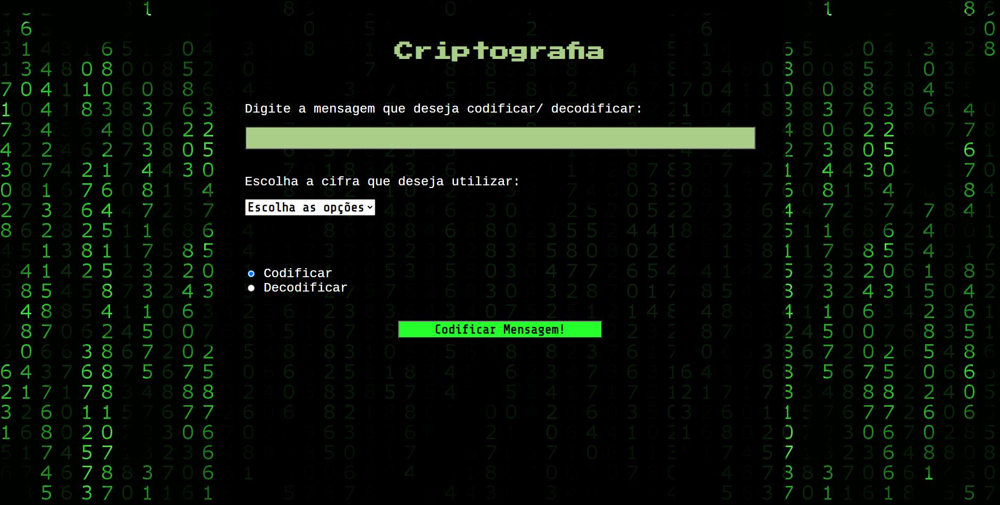

# Projeto Criptografia: Cifra de César e Base64

> ## Sobre

  Neste projeto foi desenvolvido uma aplicação capaz de codificar e decodificar mensagens utilizando cifra de César e Base64.

> ## Pré-requisitos

  - Um campo de entrada textual para a mensagem que será codificada ou decodificada;
  - Um campo de seleção, com as opções "cifra de césar" e "base64";
  - Com "cifra de césar" ativo na seleção, um novo campo deve surgir no formulário para que seja possível fornecer o incremento utilizado na cifra;
  - Dois campos radiais (radio buttons) com os textos: "codificar" e "decodificar";
  - Um botão que, com "codificar" selecionado exibe o texto "Codificar Mensagem!" e com "decodificar" selecionado exibe "Decodificar Mensagem!".

 

> ## Softwares e Ferramentas utilizadas nesse projeto 

  - HTML5
  - CSS3
  - JavaScript
  - Git

> ## Habilidades Desenvolvidas

  - Indentação do código
  - Tags semânticas (HTML)
  - Atributos (HTML)
  - Seletores e Combinadores (CSS)
  - Pseudo-classes (CSS)
  - FlexBox (CSS)
  - Responsividade (CSS)
  - Function (JS)
  - Condicionais IF, Else (JS)

> ## Autora

  - [Hadassa Moraes](https://www.linkedin.com/in/hadassa-moraes-5a6712230/)

> ## Site

  Acesse o projeto clicando <a href="https://hadmoraes.github.io/ProjetoMensagemOculta/">aqui</a>

  &#129145;&nbsp;<a href="#inicio"><strong>Voltar ao topo</strong></a>&nbsp;&#129145;

